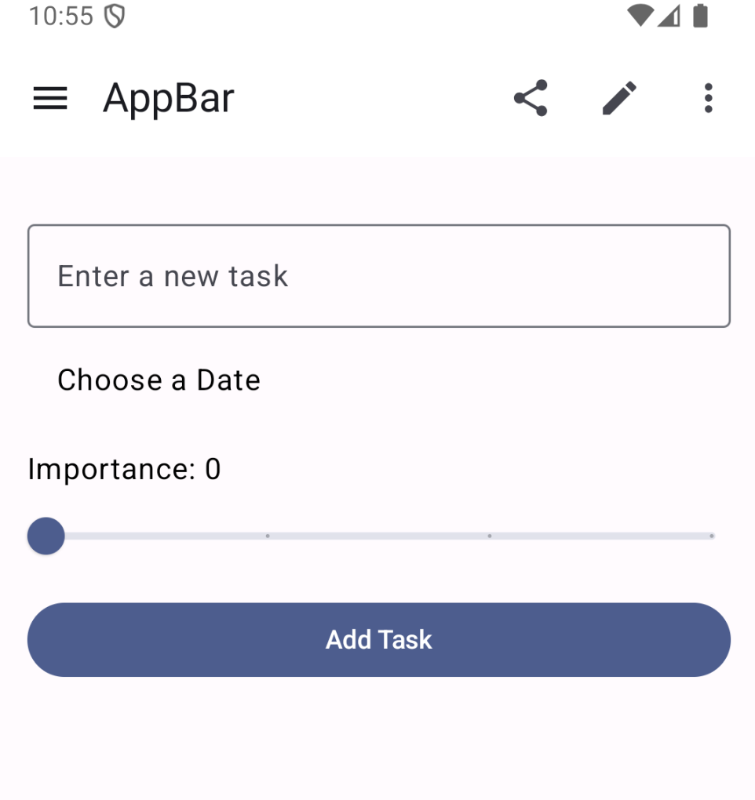
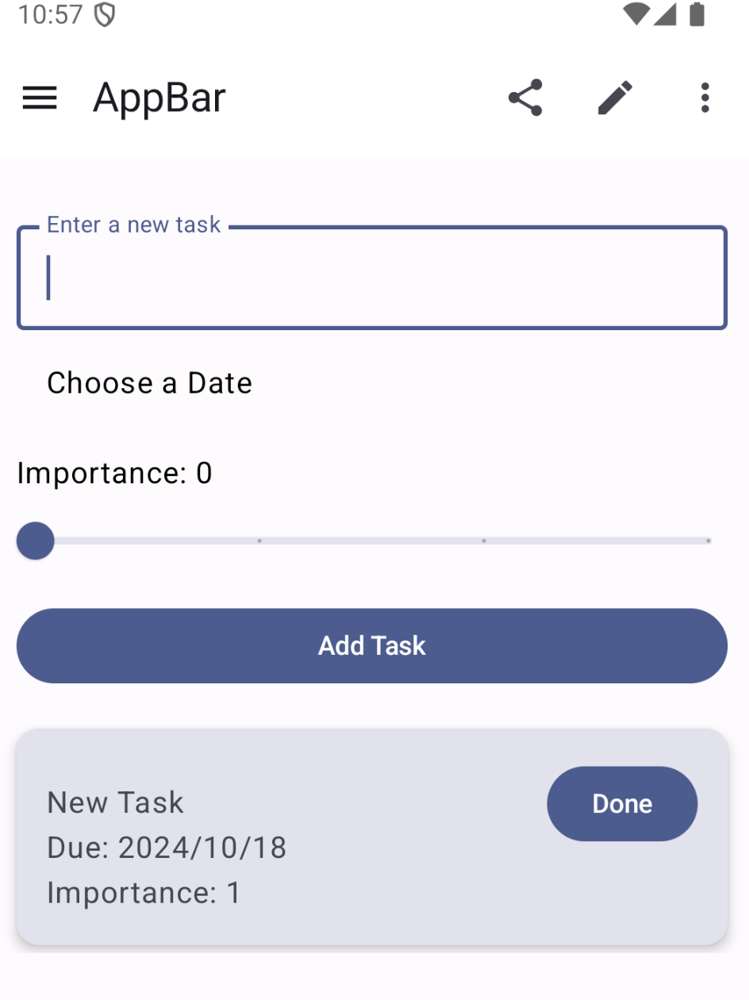
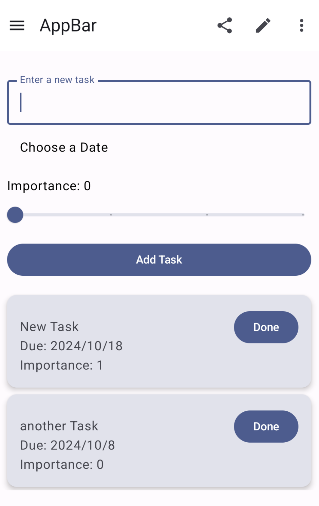
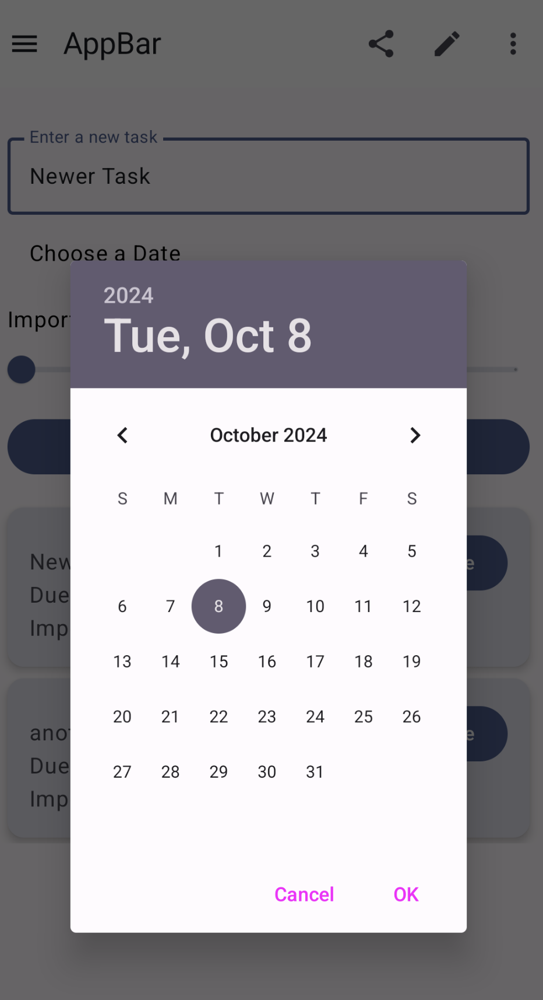
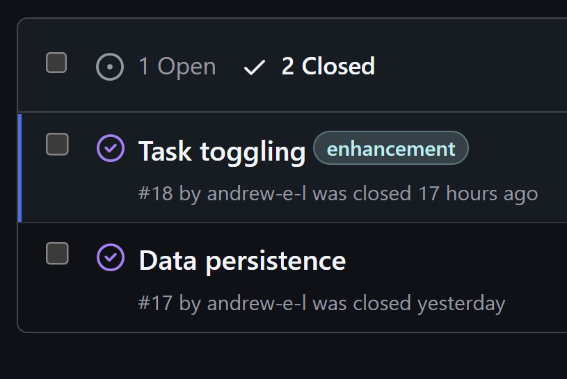
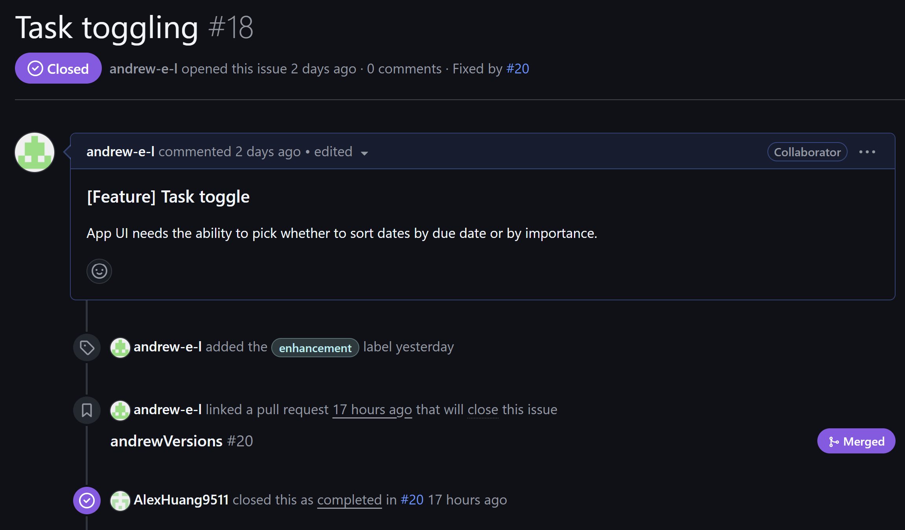
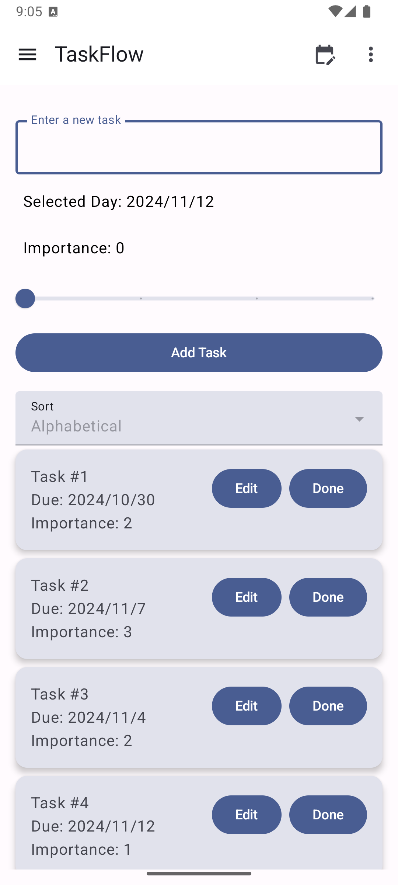

# cmpt276-TodoApp

# To do app called TaskFlow

- Alex
 56c174fbbab4c693873d285f1dde9815c0622867
Team members
- Hao Cheng (Alexander) Huang
- Andrew Lam
- Hsueh-Liang Chang
- Seungyeop Shin
- Tey Cia Meng

## Things to implement / requirements
- [x] allow user to input text
- [x] show all user inputted text
- [x] allow user to remove entries
- [x] make entries persist throughout sessions
- [x] allow user to input importance of entry
- [x] allow user to input due date of a entry
- [x] toggle to show entries by importance
- [x] toggle to show entries by due date
- [ ]  make UI prettier

## Retrospective

For this iteration we pushed to have all our basic functional requirements down while juggling midterms and other assignments, focusing on these features before all else. As a result, while the UI is not the most aesthetically pleasing, it still performs all the necessary features that we minimally set out to implement.
This iteration we continued figuring out group Github usage, as after Iteration 1 some group members were still not clear on how pull requests work, but we got it down eventually. When we were able to perform pull requests we still tested every time before merging to main.

## Running the App

Currently the app is still under development so no final build version has been made. 
We are running and testing the app with the help of the android emulator in Android Studio. 

To run the app, clone the repo and open Android Studio and run the app there (with "Run 'app'").

## Iteration 2: New Features

- Task persistence: at Iteration 1, tasks added in one user session would not be saved when the user closed the app. In the current iteration, tasks added will now be saved across sessions.
- Sort toggling: users can now choose between sorting their tasks to view by name, due date, or importance.

## Screenshots

### Iteration 1
   

### Iteration 2

#### Sorting

<table>
  <tr>
    <td style="text-align: center;">
      
      
Sorting by Date

    </td>
    <td style="text-align: center;">
      
      
Sorting by Importance

    </td>
    <td style="text-align: center;">
      
      
Sorting Alphabetically

    </td>
  </tr>
</table>

